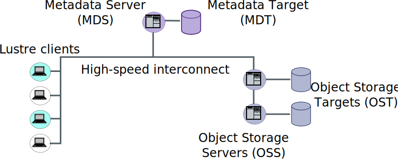

<!--
SPDX-FileCopyrightText: 2010 CSC - IT Center for Science Ltd. <www.csc.fi>

SPDX-License-Identifier: CC-BY-4.0
-->

---
title:  Working in supercomputers
event:  CSC Summer School in High-Performance Computing 2026
lang:   en
---

# Outline

- Connecting to LUMI and CSC supercomputers
- File system in LUMI and CSC supercomputers
- Module system
- Building applications
- Running applications on a supercomputer

# Connecting to LUMI and CSC supercomputers {.section}

# Anatomy of a supercomputer

{.center width=100%}

# Connecting to LUMI and CSC supercomputers

- SSH is used to connect to the login node
  - <https://github.com/csc-training/summerschool/wiki/Setting-up-CSC-account-and-SSH>
- Web interfaces also exist
  - <https://www.lumi.csc.fi>
  - <https://www.mahti.csc.fi>

# Filesystem in LUMI and CSC supercomputers {.section}

# Directory structure

- LUMI and CSC supercomputers have separate file systems
  - Files need to be explicitly copied between LUMI and Mahti
- Directory structure is common in all systems

|            |Owner   |Environment variable|Path                 |
|------------|--------|--------------------|---------------------|
|**home**    |Personal|`$HOME`             |`/users/<user-name>` |
|**projappl**|Project |Not available       |`/projappl/<project>`|
|**scratch** |Project |Not available       |`/scratch/<project>` |

- See `lumi-workspaces` on LUMI or `csc-workspaces` on Mahti

# Using project-level storage space

- Common practice: create your personal directory under scratch:
  ```bash
  mkdir -p /scratch/<project>/$USER
  cd /scratch/<project>/$USER
  ```
- Use this personal work space to avoid file conflicts with other project members

# Filesystems on CSC supercomputers

- The filesystem used on CSC systems is called **Lustre**
  - Parallel: data is distributed across many storage drives
  - Shared: Files can be accessed from all nodes
  - Lustre is very common in HPC in general, not just at CSC
- Many systems also provide node-local disk area for temporary storage
  - `/tmp`, `$TMPDIR`, `$LOCAL_SCRATCH` *etc.* depending on the system
  - Sometimes the temporary storage may reside directly in memory (`/tmp` on LUMI compute nodes)
  - See system docs for details

# Lustre architecture

<div class="column">

- Files are chunked up and spread across multiple **storage servers** as **objects**
- Dedicated **metadata server(s)** (MDS): file names, owners, permissions, ...
- **Client**: HPC node that access the data

</div>

<div class="column">


Clients interact with MDS once to gain OST access, then I/O to objects directly

- Allows for **very high, parallel I/O bandwidth!**

</div>

# Lustre metadata servers

- Every file lookup, file creation/deletion, permission change *etc.* is processed by the metadata servers
- Metadata servers are shared by everyone using the supercomputer!
- Commands like `ls` unresponsive? Servers may be under heavy load

# Being nice to Lustre (and other users)

- Avoid accessing a large number of small files
  - Practical example: Python environments are typically containerized to avoid a significant performance hit due to accessing thousands of small files when loading the enviroment
- Avoid `ls -l` and use plain `ls` instead if you don't need the extra metadata
  - Less stress on the metadata servers
- Use Lustre tools (e.g., `lfs find`) instead of regular file system tools (e.g. `find`)
  - Less stress on the metadata servers

# Editing files

- Edit directly on the supercomputer
  - Vim, emacs, nano, ...
- Edit locally with any editor and sync to the supercomputer
  - See the `rsync` script
- VSCode, Jupyter, etc apps in the web interface
  - <https://www.lumi.csc.fi>
  - <https://www.mahti.csc.fi>


# Module system {.section}

# Module environment

- Supercomputers have a large number of users with different needs for
  development environments and applications
- _Environment modules_ provide a convenient way to dynamically change the
  user's environment
- Different compiler suites and application versions can be used smoothly with different modules
  - Changing the compiler module automatically loads also the correct versions of other dependent libraries
  - Loading a module for an application sets up the correct environment with a single command


# Common module commands

<div class="column">
`module load mod`
  : Load module **mod** in shell environment

`module unload mod`
  : Remove module **mod** from environment

`module list`
  : List loaded modules

`module avail`
  : List all available modules
</div>

<div class="column">
`module spider mod`
  : Search for module **mod**

`module show mod`
  : Get information about module **mod**

`module switch mod1 mod2`
  : Switch loaded **mod1** to **mod2**
</div>


# Building applications {.section}

# Compiling and linking

<div class=column>
- A compiler turns a source code file into an object file that contains
  machine code that can be executed by the processor
- A linker combines several compiled object files into a single executable file
- Together, compiling and linking is called building
</div>
<div class=column>
{.center}
</div>

# Compiling and linking

Single file source code:

```bash
cc main.c -o main
```

- In practice programs are separated into several files
  <br>&rarr; tree-like dependency structures
- Building large programs takes time
  - Could we just rebuild the parts that changed?
- Having different options when building
  - Debug versions, enabling/disabling features, etc.


# Make

- Make allows you to define how to build individual parts of a program
  and how they depend on each other. This enables:
  - Building parts of a program and only rebuilding necessary parts
  - Building different version and configurations of a program

{.center width=40%}


# Makefiles

<div class=column>
- Make rules are defined in a file which is by default called `Makefile`
- Syntax of a rule:<br>
  ```makefile
  target: dependencies
      recipe  # Indent with a tabulator!
  ```
- If the dependencies are newer than the target, make runs the recipe
- Run first rule: `make`
- Run specific rule: `make <target>`
</div>

<div class=column>
`Makefile`:

```makefile
prog.x: prog.o util.o
    gcc prog.o util.o -o prog.x

prog.o: prog.c
    gcc -O3 -c prog.c -o prog.o

util.o: util.c
    gcc -O3 -c util.c -o util.o

clean:
    rm -f util.o prog.o prog.x
```
</div>

# Variables and patterns in rules

<div class=column>
- It is possible to define variables, for example compiler and link commands
  and flags
- Targets, dependencies and recipes can contain special wild cards
- Rerunning all the recipes can be forced with `make -B`
</div>

<div class=column>
`Makefile`:

```makefile
CC=gcc
CCFLAGS=-O3
LDFLAGS=

prog.x: prog.o util.o
    $(CC) $(LDFLAGS) $^ -o $@

%.o: %.c
    $(CC) $(CCFLAGS) -c $< -o $@

clean:
    rm -f *.o *.x
```
</div>

# Build generators

- In a large software projects, figuring out all the dependencies between
  software modules can be difficult
- `Makefile` is not necessarily portable
- In order to improve portability and make dependency handling easier, build generators
  are often used
    - Select automatically correct compilers and compiler options
    - Create `Makefile` from simpler template
- **GNU Autotools** and **cmake** are the most common build generators in HPC


# Running applications on a supercomputer {.section}

# Batch job system

- On a cluster, instead of running a program instantly, you submit your calculation job to
  a queue and the system will then execute it once the resources are available
  - The queue enables effective and fair resource usage
  - CSC uses Slurm as the queue system

# Available resources: Slurm partitions

- Compute nodes are grouped in different *partitions* for different use cases
  - Small CPU jobs, large CPU jobs, small GPU jobs, large GPU jobs, debugging, ...
- List all partitions:
  ```bash
  sinfo
  ```
- Useful practical formatting:
  ```bash
  sinfo -e -o "%16P %4a %8s %.11l %11A %6z %.9m %30G %40N"
  ```
- See also system documentation:
  - <https://docs.lumi-supercomputer.eu/runjobs/scheduled-jobs/partitions/>
  - <https://docs.csc.fi/computing/running/batch-job-partitions/>

# Slurm batch jobs

- A job defines the following:
  - The resource allocation requests
  - The script to run the calculation
    - Note! A special `srun` launcher is usually needed to launch the calculation
- Structure of a batch job script `job.sh`:
  ```bash
  #!/bin/bash
  #SBATCH <resource allocation requests>

  <script to run the calculation>
  ```
- Full example scripts in the summer school repository:
  - [README_LUMI.md](https://github.com/csc-training/summerschool/blob/main/README_LUMI.md)
  - [README_Mahti.md](https://github.com/csc-training/summerschool/blob/main/README_Mahti.md)

# Submitting batch jobs

- Submit the batch job to the queue:
  ```bash
  sbatch job.sh
  ```
- Useful hint: You can override the parameters in the job script from the command line:
  ```bash
  sbatch --nodes=1 --ntasks-per-node=4 --partition=debug job.sh
  ```

# Managing batch jobs

- Follow the status of your jobs:
  ```bash
  squeue --me
  ```
- Cancel jobs using the numeric ID of the job (`<jobid>`):
  ```bash
  scancel <jobid>
  ```
- Show job resource usage (for completed jobs):
  ```bash
  sacct <jobid>
  ```
- Useful for debugging: Launch an interactive shell on a running allocation:
  ```bash
  srun --overlap --jobid=<jobid> --pty bash
  ```


# Useful environment variables

- Following variables are available inside Slurm scripts:
  - `SLURM_JOBID`: job's id
  - `SLURM_JOB_NAME`: job's name (given in `job-name`)
  - `SLURM_JOB_NODELIST`: list of nodes allocated for the job
- Following variables are available inside program launched by `srun`:
  - `SLURM_NTASKS`: the number of tasks
  - `SLURM_PROCID`: the global id of the calling process
  - `SLURM_LOCALID`: the node-local id of the calling process
- See `man sbatch` for a complete list


# Summary {.section}

# Summary

- Login nodes are entry points to a supercomputer
- Modules and build tools help managing environment and software
- Calculations are submitted as jobs to the queueing system
